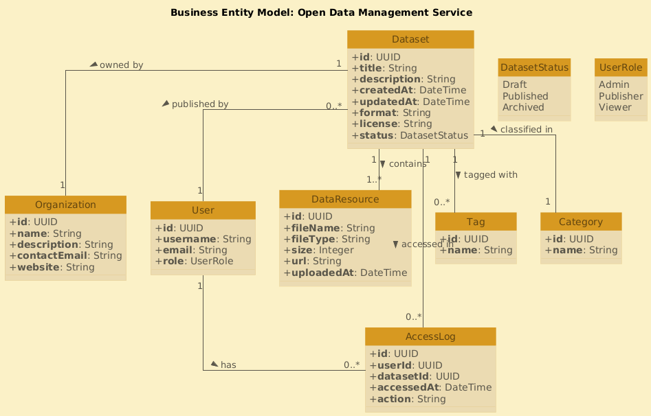

# Проєктування бази даних

## Модель бізнес-об'єктів

**Модель бізнес-об'єктів** — це опис системи, в якій відображаються всі об'єкти даної системи

**Dataset:** Основна сутність, що представляє актив відкритих даних.

**DataResource:** Файл або ресурс, пов'язаний з набором даних.

**Organization** Організація (державна установа, компанія тощо), яка володіє або публікує набори даних.

**User:** користувач платформи з певною роллю.

**Tag:** Ключові слова або теми, присвоєні наборам даних.

**Category:** Класифікація високого рівня (наприклад, охорона здоров'я, транспорт).

**AccessLog:** Записи про взаємодію користувача з наборами даних.

```
@startuml
title Business Entity Model: Open Data Management Service

class Dataset {
  +id: UUID
  +title: String
  +description: String
  +createdAt: DateTime
  +updatedAt: DateTime
  +format: String
  +license: String
  +status: DatasetStatus
}

enum DatasetStatus {
  Draft
  Published
  Archived
}

class Organization {
  +id: UUID
  +name: String
  +description: String
  +contactEmail: String
  +website: String
}

class User {
  +id: UUID
  +username: String
  +email: String
  +role: UserRole
}

enum UserRole {
  Admin
  Publisher
  Viewer
}

class DataResource {
  +id: UUID
  +fileName: String
  +fileType: String
  +size: Integer
  +url: String
  +uploadedAt: DateTime
}

class Tag {
  +id: UUID
  +name: String
}

class Category {
  +id: UUID
  +name: String
}

class AccessLog {
  +id: UUID
  +userId: UUID
  +datasetId: UUID
  +accessedAt: DateTime
  +action: String
}

Dataset "1" -- "1..*" DataResource : contains >
Dataset "1" -- "0..*" Tag : tagged with >
Dataset "1" -- "1" Organization : owned by >
Dataset "1" -- "1" Category : classified in >
Dataset "0..*" -- "1" User : published by >
User "1" -- "0..*" AccessLog : has >
Dataset "1" -- "0..*" AccessLog : accessed in >
@enduml
```


## ER-модель

**ER-модель** — це опис об'єктів системи та їх зв'язків

```
@startuml
title ER Model - Open Data Management Service

' Enums
enum DatasetStatus {
  Draft
  Published
  Archived
}

enum UserRole {
  Admin
  Publisher
  Viewer
}

' Entities
class Dataset {
  +id: UUID
  +title: String
  +description: String
  +createdAt: DateTime
  +updatedAt: DateTime
  +format: String
  +license: String
  +status: DatasetStatus
}

class DataResource {
  +id: UUID
  +fileName: String
  +fileType: String
  +size: Integer
  +url: String
  +uploadedAt: DateTime
}

class Organization {
  +id: UUID
  +name: String
  +description: String
  +contactEmail: String
  +website: String
}

class User {
  +id: UUID
  +username: String
  +email: String
  +role: UserRole
}

class Tag {
  +id: UUID
  +name: String
}

class Category {
  +id: UUID
  +name: String
}

class AccessLog {
  +id: UUID
  +accessedAt: DateTime
  +action: String
}

' Relationships
Dataset "1" -- "1..*" DataResource : has >
Dataset "1" -- "0..*" Tag : tagged with >
Dataset "1" -- "1" Organization : owned by >
Dataset "1" -- "1" Category : classified in >
Dataset "0..*" -- "1" User : published by >
User "1" -- "0..*" AccessLog : makes >
Dataset "1" -- "0..*" AccessLog : accessed in >

@enduml
```


## Реляційня схема

**Реляційна схема** — це формальне представлення структури бази даних у вигляді набору таблиць (реляцій), які описують зв’язки між різними сутностями та їх атрибутами.

```
@startuml
title Relational Schema - Open Data Management Service

' Gruvbox Light theme visual tweaks
skinparam style strictuml
skinparam roundCorner 0
skinparam shadowing false
skinparam backgroundColor #fbf1c7
skinparam classBackgroundColor #ebdbb2
skinparam classBorderColor #d79921
skinparam ClassAttributeFontColor #5a564a
skinparam classBorderThickness 0
skinparam classFontColor #61440e
skinparam classFontSize 14
skinparam classAttributeIconSize 0
skinparam ArrowColor #5a564a
skinparam ArrowFontColor #5a564a
skinparam linetype ortho

' Add color to class headers
skinparam classHeaderBackgroundColor #d79921

' ENUMS
enum DatasetStatus {
  Draft
  Published
  Archived
}

enum UserRole {
  Admin
  Publisher
  Viewer
}

' ========== TABLES ==========
class Dataset {
  +PK **id**: UUID
  +**title**: String
  +**description**: Text
  +**created_at**: DateTime
  +**updated_at**: DateTime
  +**format**: String
  +**license**: String
  +**status**: DatasetStatus
  +FK **organization_id**: UUID
  +FK **category_id**: UUID
  +FK **user_id**: UUID
}

class DataResource {
  +PK **id**: UUID
  +**file_name**: String
  +**file_type**: String
  +**size**: Integer
  +**url**: String
  +**uploaded_at**: DateTime
  +FK **dataset_id**: UUID
}

class Organization {
  +PK **id**: UUID
  +**name**: String
  +**description**: Text
  +**contact_email**: String
  +**website**: String
}

class User {
  +PK **id**: UUID
  +**username**: String
  +**email**: String
  +**role**: UserRole
}

class Tag {
  +PK **id**: UUID
  +**name**: String
}

class Category {
  +PK **id**: UUID
  +**name**: String
}

class AccessLog {
  +PK **id**: UUID
  +**accessed_at**: DateTime
  +**action**: String
  +FK **user_id**: UUID
  +FK **dataset_id**: UUID
}

class DatasetTag {
  +PK **dataset_id**: UUID
  +PK **tag_id**: UUID
}

' ========== RELATIONSHIPS ==========
Dataset "1" -- "0..*" DataResource : has >
Dataset "1" -- "0..*" DatasetTag : uses >
Tag "1" -- "0..*" DatasetTag : used in >
Dataset "1" -- "0..*" AccessLog : accessed in >
User "1" -- "0..*" AccessLog : makes >
Dataset "1" -- "1" Organization : owned by >
Dataset "1" -- "1" Category : classified in >
Dataset "1" -- "1" User : published by >

@enduml
```

